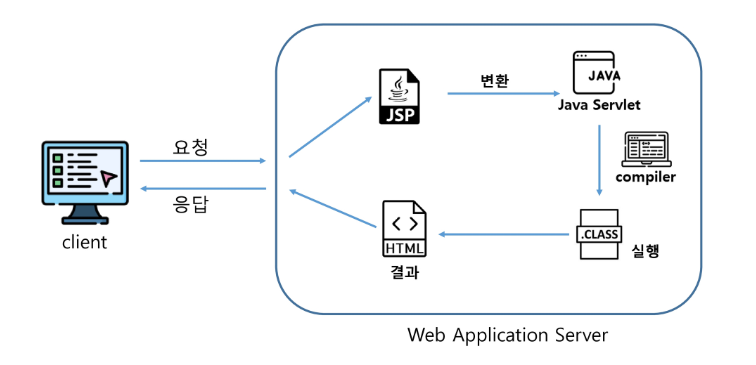

# Web-BackEnd-02
## JSP (Java Server Page)
- Servlet 표준을 기반으로 작성된 웹 어플리케이션 개발 언어
- HTML 내에 Java를 작성하여 동적으로 웹페이지를 생성하여 브라우저에 돌려주는 페이지
- 실행 시 Servlet으로 변환된 후 실행

### JSP 동작


### JSP 구성요소
- 지시자(Directive)
    - JSP 페이지에 대한 설정 정보를 지정하기 위해서 사용
- 스크립트 요소
    - Scriptlet, Expression, Declaration
    - JSP에서 문서의 내용을 동적으로 생성하기 위해서 사용
- JSP 기본객체
    - 요청 및 응답 관련 정보를 얻거나, 응답 결과를 만들기 위해서 사용
- 표현언어 (Expression Language)
    - JSP를 좀 더 간결하게 작성하기 위해서 사용
- Action Tag, JSTL
    - 자주 사용하는 기능을 모아 미리 정의하여 Tag형태로 작성한다
    - JSP에서 자바 코드를 쉽게 작성할 수 있도록 사용

## JSP 기본태그
|종류|사용용도|형식|
|:--:|:--:|:--:|
|스크립틀릿(scriptlet)|자바코드 작성|<% %>|
|선언(declaration)|변수와 메서드를 선언|<%! %>|
|표현식(expression)|계산식이나 함수를 호출한 결과를 문자열 형태로 출력|<%= %>|
|주석|주석|<%-- --%>|
|지시자(directive)|JSP 페이지 속성 지정|<%@ %>|

### 스크립트릿 (Scriptlet)
- 스크립팅 언어(java)로 작성된 코드 조각을 포함하는데 사용된다.
```jsp
<%
    int A = 10;
    int B = 20;
    
    int sum = A + B ;
    
    out.print(A+"+"+B+"="+sum);
%>
```
    ```html
    <text> 10+20=30 </text>
    ```

### 선언부 (Declaration)
- 멤버변수 선언이나 메서드를 선언하는 영역
```jsp
	<%! 
		int A = 10;
		int B = -20;
		
		String name = "SSAFY";
		
		//메서드 선언 가능
		public int add(int A, int B) {
			return A + B;
		}
		
		public int abs(int A) {
			return A > 0 ? A : -A;
		}
	%>
```

### 표현식 (Expression)
- 변수의 값이나 계산식 혹은 함수를 호출한 결과를 문자열 형태로 웹문서에 출력
```jsp
<%=name %>
<%=A+B %>
<%=add(A, B) %>
```

### 주석 (Comment)
```jsp
<!-- HTML 주석, 클라이언트에게 노출 -->
<%-- JSP 주석, 클라이언트에게 노출되지 않음 --%>
<% 
    // 자바 주석도 클라이언트에 노출되지 않음 
%>
```

### 지시자 (Directive)
- 웹컨테이너(Tomcat)가 JSP 번역하고 실행하는 방법을 서술
- page: 해당 JSP페이지 전반적으로 환경을 설정할 내용 지정
    - JSP 페이지 실행 매개변수를 제어
    - 출력처리, 오류처리 등의 내용을 포함
```jsp
<%@ page language="java" contentType="text/html; charset=UTF-8"
    pageEncoding="UTF-8"%>
```
- include: 현재 페이지에 다른 파일의 내용 삽입할 때 사용
    - JSP 내에 다른 HTML 문서나 JSP 페이지의 내용을 삽입할 때 사용
    - 반복되는 코드의 재작성을 줄일 수 있다.
```jsp
<%@ include file="/template/header.jsp" %>
```
- taglib: 태그 라이브러리에서 태거를 사용할 수 있는 기능 제공
    - JSTL 또는 사용자가 작성한 커스텀 태그를 사용할 때 작성
    - 불필요한 자바코드를 줄일 수 있다
```jsp
<%@ taglib uri="http://java.sun.com/jsp/jstl/core" prefix="c" %>
```

## JSP 기본 객체
- 서버 정보 및 요청, 응답에 대한 데이터 조회, 조작을 위한 객체


### 기본 객체 영역 (Scope)


### 기본 객체 영역 메서드
- sevlet과 페이지간 정보를 공유하기 위한 메서드


## 페이지 이동
- 포워드 방식
```java
// django render 느낌,,?
RequestDispatcher disp = req.getRequestDispatcher("/result.jsp");
disp.forward(req, resp);
```
- 리다이렉트 방식
```java
// django redirect 느낌?
resp.sendRedirect("location");
```