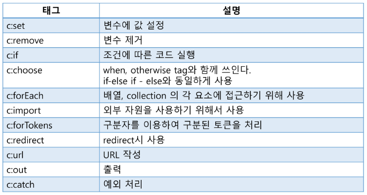

# EL & JSTL
## EL (Expression Language)
- data를 웹 페이지에 표시하는데 사용되는 태그
- JSP 스크립트릿의 표현식(<%= %>)을 대신하여 속성값을 쉽게 출력할 수 있도록 고안됨
```jsp
<%= "Hello" %>
	
${"Hello" }
```
- Map 객체 또는 Java Bean 객체의 경우 도트(.)연산을 사용하여 속성을 출력할 수 있다.
- JSP 영역 기본 객체 (page, request, session, application) 속성 사용가능

### EL 문법
```jsp
<!-- 스크립트릿 -->
<%= ((com.ssafy.model.MemberDto)
request.getAttribute("userinfo")).getZipDto().getAddress() %>
```
```jsp
<!-- EL -->
${userinfo.zipDto.address}
```
- []연산자를 이용해서 객체의 속성에 접근 가능
    - 대상 객체가 Map 또는 Java Bean인 경우 ${obj["key(property)"]} 형태로 사용가능
    - 대상 객체가 리스트 또는 배열의 경우 \${obj[index]} 또는 ${obj["index"]} 형태로 사용가능

|분류|객체|타입|설명|
|:--:|:--:|:--:|:--|
|JSP|pageContext|Java Bean|현재 페이지의 page context instance|
|scope|pageScope|Map|page 기본 객체에 저장된 속성을 저장하는 객체|
||requestScope|Map|request 기본 객체에 저장된 속성을 저장하는 객체|
||sessionScope|Map|session 기본 객체에 저장된 속성을 저장하는 객체|
||applicationScope|Map|application 기본 객체에 저장된 속성을 저장하는 객체|
|요청<br>파라미터|param|Map|JSP 내장 객체 request의 getParameter(name) 메서드와 동일한 역할<br>\${param.name} , \${param["name"]}|
||paramValues|Map|JSP 내장 객체 request의 getParameterValues(name) 메서드와 동일한 역할|
|쿠키|cooki|Map|현재 페이지의 page context instance|
|요청헤더|header|Map|request의 getHeader(name) 메서드와 동일한 역할|
||headerValues|Map|request의 getHeaders(name) 메서드와 동일한 역할|

### EL로 기본 객체 속성 설정하기 / 요청 파라미터 처리하기
```jsp
request.setAttribute("userInfo", "ssafy");
${requestScope.userInfo}
${pageContext.request.userInfo}
${userInfo} 
<!-- property 이름만 사용할 경우 pageScope > requestScope > sessionScope > applicationScope 순서대로 객체를 찾음 -->
```

## JSTL (JSP Standard Tag Library)
### JSTL (JSP Standart Tag Library)
- JavaEE 기반의 웹 어플리케이션 개별을 위한 컴포넌트 모음

### 기능
- 변수선언, if문, for문 등
- 데이터 출력 포맷 설정
- DB 입력, 수정, 삭제, 조회
- 문자열 처리 함수
- XML 문서 처리

### JSTL 사용하기
|기능|prefix|URI|
|:--:|:--:|:--:|
|기본기능, 변수 선언, 로직 구현|c|http://java.sun.com/jsp/jstl/core|
|데이터 출력 포맷|fmt|http://java.sun.com/jsp/jstl/fmt|
|데이터베이스 작업|sql|http://java.sun.com/jsp/jstl/sql|
|XML 관련 기능|x|http://java.sun.com/jsp/jstl/xml|
|문자열 처리 함수|fn|http://java.sun.com/jsp/jstl/fn|

### JSTL - Core


### c:set
```jsp
<c:set var="변수 이름" value="변수 값" scope="유효 영역(default: page)" target="속성값을 지정할 java bean객체"/>
```
- ex
```jsp
<c:set var="name" value="ssafy" scope="request"/>
request.setAttribute("name", "ssafy")
```
- java bean 객체에 속성값 지정
```jsp
<c:set var="user1" value="<%= new com.ssafy.model.User() %>"/>
```
```jsp
<c:set target="${user1}" property="name" value="ssafy"></c:set>
```

### c:if
```jsp
<c:if test="조건식">
    조건이 참일 경우 실행할 문장
</c:if>
```
```jsp
<c:if test="${writerid == userid }">
    <a href="url">삭제</a>
</c:if>
```

### c:forEach
- begin, end, stap 속성을 이용해 반복
- varStatus 속성을 이용해 요소의 순번, 개수 등을 출력할 수 있다.
```jsp
<c:forEach [var="변수"] items="반복할 객체">
    동작코드
</c:forEach>
```