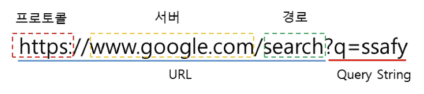
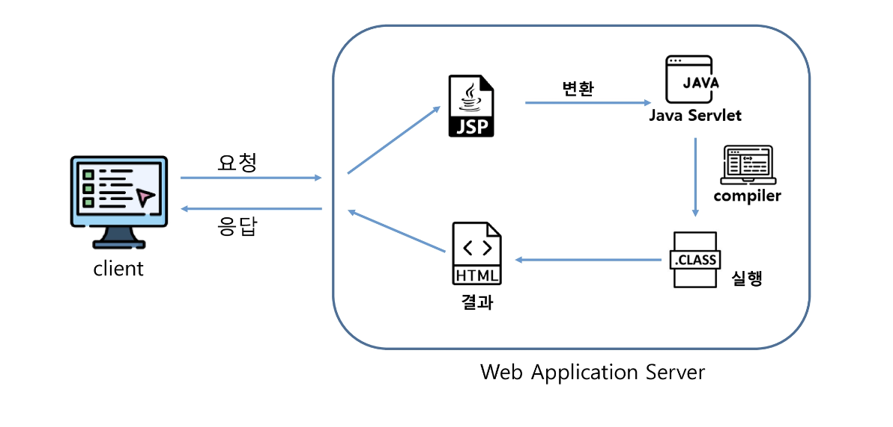
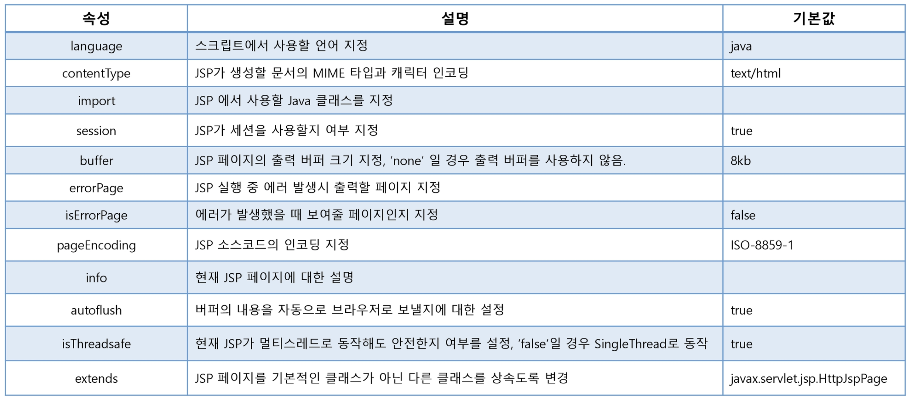
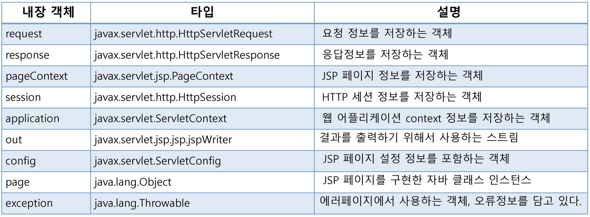
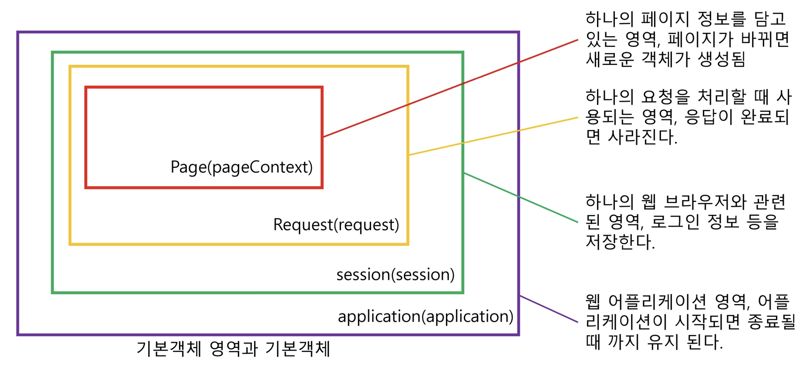
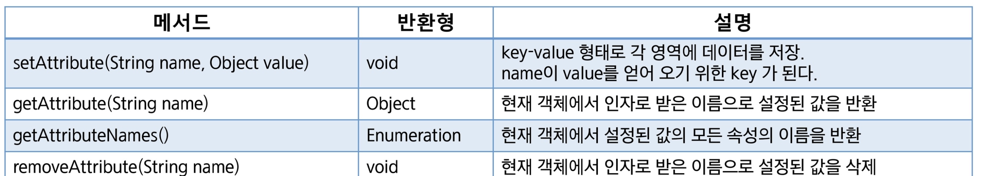
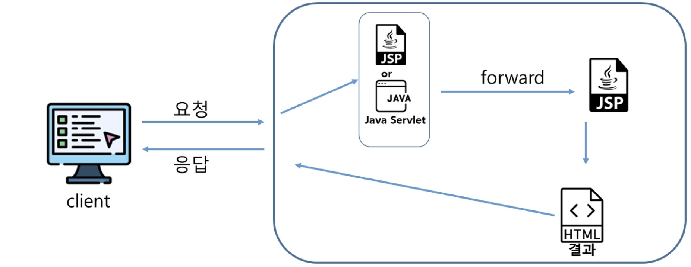
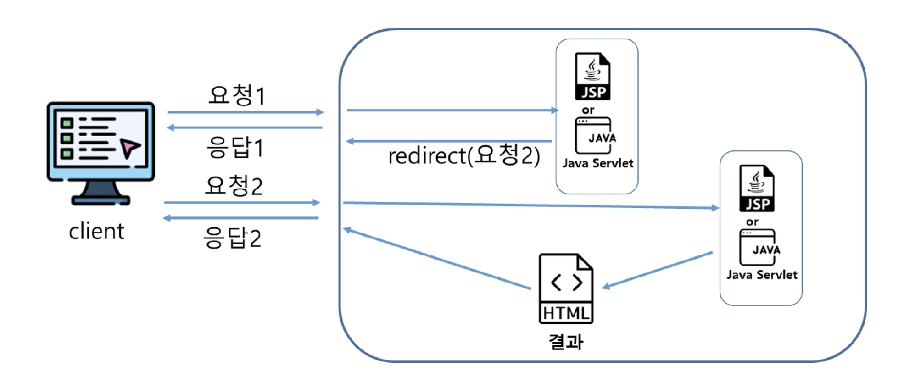

# Web Back

----

## Servlet

- Serve + Applet의 합성어
- 자바를 이용하여 웹에서 실행되는 프로그램을 작성하는 기술
- 자바를 이용하여 웹페이지를 동적으로 생성할 수 있음
- Servlet은 자바 코드 안에 HTML을 포함

## Servlet 생명주기

- 서블릿 인스턴스는 서블릿이 포함된 웹컨테이너에 의해 제어된다.
- 서블릿 인스턴스가 존재하지 않으면 다음과 같은 작업을 수행한다.
    1. 서브릿 클래스 로드
    2. 서블릿 클래스 인스턴스 생성
    3. 서블릿 인스턴스 초기화
    4. 웹 컨테이너에 의한 서비스 메서드 호출
    5. destroy 메서드를 호출하여 서블릿 종료
- 서비스 메서드는 요청이 들어올 때마다 호출된다.

## Servlet Parameter

### GET과 POST

- GET
  - 지정된 리소스에서 데이터를 요청하는 데 사용
  - query string(name/value 쌍)이 URL에 포함되어 전송됨
  - POST와 비교하여 보안에 취약함
  - URL이 길이 제한이 있으므로, 전송 가능한 데이터의 길이가 제한적(2048) ASC|| 문자만 가능

- POST
  - 리소스를 생성, 업데이트 하기 위해 서버에 데이터를 보내는 데 사용
  - HTTP header의 body에 파라미터를 포함하여 전송
  - 데이터 길이에 대한 제한 없음
  - 매개변수가 브라우저나 웹 서버에 저장되지 않음
  - 길이 제한 없음. 바이너리 데이터도 허용

### URL 구성 요소



- 프로토콜 : 절차를 포함한 통신규약
- 서버 : 웹 페이지를 요청할 서버의 주소, 실제 IP 주소나 도메인을 입력할 수 있다.
- 경로 : 서버 내의 상세 경로
- 쿼리 스트링 : 추가로 서버로 데이터를 전송하기 위해서 사용한다.
'?' 마크를 적어 시작 표시. parameter_name=value 형태로 작성하며 파라미터가 여러 개일 경우 '&'로 구분하여 작성한다.

### Front-Controller

- 웹에서 발생하는 모든 요청에 대해 호출되는 Servlet을 만들어 처리함

-----

## JSP (Java Server Page)

### JSP

- Servlet 표준을 기반으로 작성된 웹 애플리케이션 개발 언어
- HTML 내에 java를 작성하여 동적으로 웹페이지를 생성하여 브라우저에게 돌려주는 페이지
- 실행 시 Servlet으로 변환된 후 실행

&rarr; BackEnd_Day00_Hello 참고

### JSP 동작



### JSP 구성 요소

- 지시자(Directive)
  - JSP 페이지에 대한 설정 정보를 지정하기 위해서 사용
- 스크립트 요소
  - 스크립트릿(Scriptlet), 표현식(Expression), 선언부(Declaration)
  - JSP에서 문서의 내용을 동적으로 생성하기 위해서 사용
- JSP 기본객체
  - 요청 및 응답 관련 정보를 얻거나, 응답 결과를 만들기 위해서 사용
- 표현언어 (Expression Language)
  - JSP를 좀 더 간결하게 작성하기 위해서 사용
- Action Tag와 JSTL
  - 자주 사용하는 기능을 모아 미리 정의하여 Tag 형태로 작성한다.
  - JSP에서 자바 코드를 쉽게 작성할 수 있도록 사용

### JSP 기본태그

- 스크립트릿(scriptlet) : 자바코드 작성
  - <% %>
- 선언(declaration) : 변수와 메서드 선언
  - <%! %>
- 표현식(expression) : 계산식이나 함수를 호출한 결과를 문자열 형태로 출력
  - <%= %>
- 주석(comment) : JSP 페이지 설명 작성
  - <%-- --%>
- 지시자(directive) : JSP 페이지 속성 지정
  - <%@ %>

### 지시자 - page



### 지시자 - include

- JSP 내에 다른 HTML 문서나 JSP 페이지의 내용을 삽입할 때 사용한다.
- 반복적으로 사용되는 부분(header, footer 등) 별도로 작성하여 페이지 내에 삽입하면 반복되는 코드의 재작성을 줄일 수 있다.

### 지시자 - taglib

- JSTL 또는 사용자가 작성한 커스텀 태그를 사용할 때 작성한다.
- 불필요한 자바 코드를 줄일 수 있다.

------

## JSP 기본객체

### JSP 기본 객체

- JSP 에서는 서버 정보 및 요청, 응답에 대한 데이터를 조회, 조작하기 위한 객체를 제공하고 있다.



### JSP 기본 객체 영역 (Scope)



### JSP 기본 객체 영역(Scope) 메서드

- servlet과 페이지간 정보를 공유하기 위해서 메서드를 지원한다.



-----

## 페이지 이동

- 요청(request)을 받아서 화면을 변경하는 방법은 두 가지가 있다.

1. 포워드 방식

- 요청이 들어오면 요청을 받은 JSP 또는 Servlet이 직접 응답을 작성하지 않고, 요청을 서버 내부에서  전달하여 해당 요청을 처리하게 하는 방식

```java
Request Dispat cher dispatcher = request.getRequestDi spat cher("이동할페이지"); dispatcher. forward (request, response);
```



2. 리다이렉트 방식

- 요청이 들어오면 내부 로직 실행 후, 브라우저의 URL을 변경하도록 하여 새로운 요청을 생성함으로써 페이지를 이동한다.

```java
response.sendRedirect("location");
```


